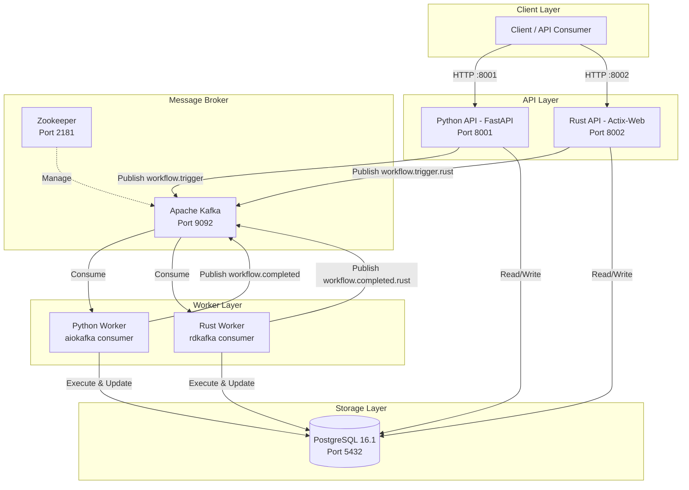
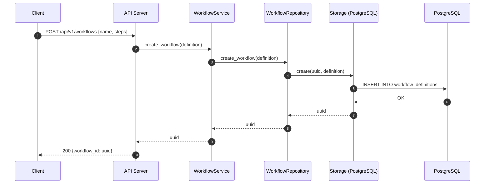
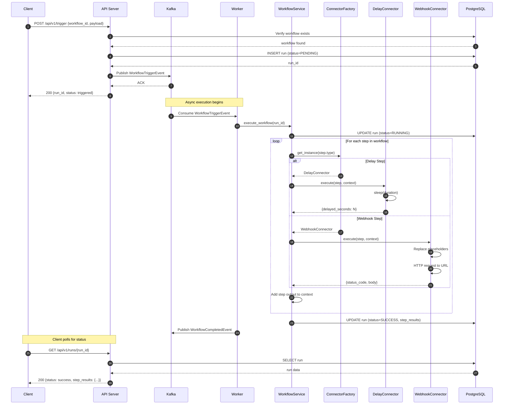
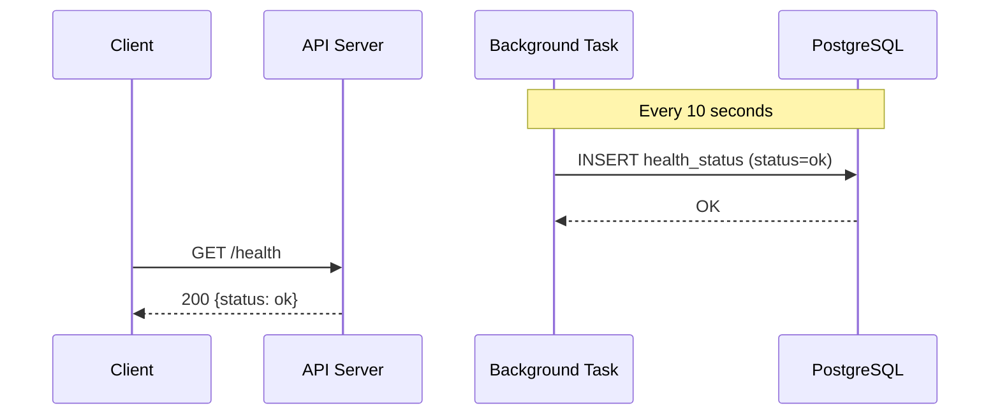

# Workflow Automation Platform

A production-ready, **dual-implementation** workflow automation platform built with **Python (FastAPI)** and **Rust (Actix-Web)**, backed by PostgreSQL, Apache Kafka, Redis, PgBouncer, and Nginx for high-throughput, event-driven execution.

Both implementations share the same database, Kafka cluster, Redis cache, and API contract — enabling direct performance comparison under identical conditions.

**Phase 2 Results (1000 concurrent users, 0% error rate):**
- **Python:** 1,084 req/s · 523ms mean latency · P99 1,076ms
- **Rust:** 4,017 req/s · 161ms mean latency · P99 364ms
- **Infrastructure:** 3× API replicas · Nginx LB · PgBouncer · Redis · 3 Kafka partitions

---

## Table of Contents

- [Distributed Architecture](#distributed-architecture)
- [Features](#features)
- [System Architecture Diagram](#system-architecture-diagram)
- [Component Architecture](#component-architecture)
- [Sequence Diagrams](#sequence-diagrams)
- [Quick Start](#quick-start)
- [API Endpoints](#api-endpoints)
- [Project Structure](#project-structure)
- [Design Principles (SOLID)](#design-principles-solid)
- [Docker Services](#docker-services)
- [Configuration](#configuration)
- [Testing](#testing)
- [Performance Benchmarks](#performance-benchmarks)
- [Documentation](#documentation)
- [License](#license)

---

## Distributed Architecture

```
┌─────────────────────────────────────────────────────────────────────────────────────┐
│                        WORKFLOW AUTOMATION PLATFORM                                   │
│                        Distributed Event-Driven Architecture                         │
│                                                                                      │
│   ┌──────────┐                                                                       │
│   │  Client   │─────────────────────────────┐                                        │
│   │ (Browser, │                             │                                        │
│   │  CLI,     │──────────────────┐          │                                        │
│   │  Script)  │                  │          │                                        │
│   └──────────┘                  │          │                                        │
│                                  │          │                                        │
│   ┌──────────────────────────────┼──────────┼──────────────────────────────────────┐ │
│   │           API LAYER          │          │                                      │ │
│   │                              ▼          ▼                                      │ │
│   │   ┌──────────────────┐  ┌──────────────────┐                                  │ │
│   │   │  Python API      │  │  Rust API        │                                  │ │
│   │   │  FastAPI+Uvicorn │  │  Actix-Web       │                                  │ │
│   │   │  Port 8001       │  │  Port 8002       │                                  │ │
│   │   │                  │  │  (10 workers)    │                                  │ │
│   │   │  Endpoints:      │  │  Endpoints:      │                                  │ │
│   │   │  /api/v1/*       │  │  /api/v1/*       │                                  │ │
│   │   └────────┬─────────┘  └────────┬─────────┘                                  │ │
│   │            │                     │                                             │ │
│   └────────────┼─────────────────────┼─────────────────────────────────────────────┘ │
│                │                     │                                                │
│   ┌────────────┼─────────────────────┼─────────────────────────────────────────────┐ │
│   │            │   MESSAGE BROKER    │                                             │ │
│   │            ▼                     ▼                                             │ │
│   │   ┌────────────────────────────────────────────┐                              │ │
│   │   │              Apache Kafka                   │                              │ │
│   │   │                                            │                              │ │
│   │   │  Topics:                                   │                              │ │
│   │   │  ┌──────────────────┐ ┌──────────────────┐ │                              │ │
│   │   │  │ workflow.trigger │ │workflow.completed │ │                              │ │
│   │   │  │ (Python)         │ │ (Python)          │ │                              │ │
│   │   │  └──────────────────┘ └──────────────────┘ │                              │ │
│   │   │  ┌──────────────────┐ ┌──────────────────┐ │                              │ │
│   │   │  │workflow.trigger  │ │workflow.completed │ │                              │ │
│   │   │  │.rust             │ │.rust              │ │                              │ │
│   │   │  └──────────────────┘ └──────────────────┘ │                              │ │
│   │   │                                            │  ┌───────────────────┐       │ │
│   │   └──────────────────────┬─────────────────────┘  │    Zookeeper      │       │ │
│   │                          │                        │    (Kafka mgmt)   │       │ │
│   └──────────────────────────┼────────────────────────┴───────────────────┴───────┘ │
│                              │                                                       │
│   ┌──────────────────────────┼───────────────────────────────────────────────────┐   │
│   │          WORKER LAYER    │                                                   │   │
│   │                          ▼                                                   │   │
│   │   ┌──────────────────┐  ┌──────────────────┐                                │   │
│   │   │  Python Worker   │  │  Rust Worker     │                                │   │
│   │   │  (aiokafka)      │  │  (rdkafka)       │                                │   │
│   │   │                  │  │                  │                                │   │
│   │   │  Consumes:       │  │  Consumes:       │                                │   │
│   │   │  workflow.trigger│  │  workflow.trigger │                                │   │
│   │   │                  │  │  .rust            │                                │   │
│   │   │  Executes:       │  │  Executes:        │                                │   │
│   │   │  • Delay steps   │  │  • Delay steps   │                                │   │
│   │   │  • Webhook steps │  │  • Webhook steps │                                │   │
│   │   └────────┬─────────┘  └────────┬─────────┘                                │   │
│   │            │                     │                                           │   │
│   └────────────┼─────────────────────┼───────────────────────────────────────────┘   │
│                │                     │                                                │
│   ┌────────────┼─────────────────────┼───────────────────────────────────────────┐   │
│   │            │   STORAGE LAYER     │                                           │   │
│   │            ▼                     ▼                                           │   │
│   │   ┌────────────────────────────────────────────┐                            │   │
│   │   │           PostgreSQL 16.1                   │                            │   │
│   │   │                                            │                            │   │
│   │   │  Tables:                                   │                            │   │
│   │   │  ┌──────────────────────────────────────┐  │                            │   │
│   │   │  │ health_status                        │  │                            │   │
│   │   │  │ workflow_definitions                 │  │                            │   │
│   │   │  │ workflow_runs                        │  │                            │   │
│   │   │  └──────────────────────────────────────┘  │                            │   │
│   │   │                                            │                            │   │
│   │   │  Shared by both Python and Rust services   │                            │   │
│   │   └────────────────────────────────────────────┘                            │   │
│   └─────────────────────────────────────────────────────────────────────────────┘   │
│                                                                                      │
└──────────────────────────────────────────────────────────────────────────────────────┘
```

---

## Features

### Core Features

- **Dual Implementation** — Identical APIs in Python (FastAPI) and Rust (Actix-Web) for direct comparison
- **Event-Driven Architecture** — Kafka-based async workflow execution with decoupled producers/consumers
- **REST API** — Full CRUD for workflow definitions, trigger execution, query run status
- **Pluggable Connectors** — Delay and Webhook connectors via Factory Pattern; easily extensible
- **Multiple Storage Backends** — InMemory, FileSystem, PostgreSQL (Python); PostgreSQL (Rust)
- **Horizontal Scaling** — 3× API replicas behind Nginx LB + 3× workers per language via Kafka consumer groups
- **Connection Pooling** — PgBouncer (600 max connections, transaction pooling) between all apps and PostgreSQL
- **Centralized Caching** — Redis cache with TTL (60s workflows, 10s runs) for cache-aside reads
- **Cursor Pagination** — `GET /runs?limit=50&cursor=` eliminates full table scans
- **Fault Tolerance** — Kafka provides message durability; asyncio.Lock on Python producer; graceful error handling

### Architecture Features

- **SOLID Principles** — Every layer follows Single Responsibility, Open/Closed, Liskov Substitution, Interface Segregation, and Dependency Inversion
- **Layered Architecture** — API → Service → Repository → Storage → Database
- **Factory Pattern** — Connector and Storage creation via factories
- **Dependency Injection** — FastAPI `Depends()` (Python) / `web::Data<AppState>` (Rust)
- **Trait-Based Abstractions** — `Storage<T>` trait (Rust) / `BaseStorage` ABC (Python)

### Operational Features

- **Fully Dockerized** — Zero local dependencies; everything runs in containers
- **Health Checks** — Built-in `/health` endpoints with periodic DB health writes
- **Background Tasks** — Health status persistence runs as async background task
- **Structured Logging** — `tracing` (Rust) / Python logging with structured output
- **Regression Testing** — Automated 1000-user concurrent benchmark suite

---

## System Architecture Diagram



---

## Component Architecture

### Layered Architecture (Both Implementations)

```
┌─────────────────────────────────────────────────────────────────────────┐
│                         LAYERED ARCHITECTURE                             │
│                                                                          │
│  ┌─────────────────────────────────────────────────────────────────┐    │
│  │                      API LAYER                                   │    │
│  │  Handles HTTP requests, input validation, response formatting    │    │
│  │                                                                  │    │
│  │  Python: FastAPI routers + Pydantic validation                   │    │
│  │  Rust:   Actix-Web handlers + serde deserialization              │    │
│  └──────────────────────────┬──────────────────────────────────────┘    │
│                              │                                           │
│  ┌──────────────────────────▼──────────────────────────────────────┐    │
│  │                    SERVICE LAYER                                  │    │
│  │  Business logic orchestration: create, execute, manage workflows  │    │
│  │                                                                  │    │
│  │  WorkflowService                                                 │    │
│  │  • create_workflow()    • execute_workflow()                      │    │
│  │  • load_workflow()      • execute_step()                         │    │
│  │  • create_workflow_run() • update_workflow_run()                  │    │
│  └──────────────────────────┬──────────────────────────────────────┘    │
│                              │                                           │
│  ┌──────────────────────────▼──────────────────────────────────────┐    │
│  │                  REPOSITORY LAYER                                 │    │
│  │  Data access abstraction: wraps storage with domain-specific ops  │    │
│  │                                                                  │    │
│  │  WorkflowRepository     WorkflowRunRepository                    │    │
│  │  • get_workflow()       • get_workflow_run()                      │    │
│  │  • create_workflow()    • create_workflow_run()                   │    │
│  │  • list_workflows()     • list_workflow_runs()                    │    │
│  └──────────────────────────┬──────────────────────────────────────┘    │
│                              │                                           │
│  ┌──────────────────────────▼──────────────────────────────────────┐    │
│  │                    STORAGE LAYER                                  │    │
│  │  Persistence abstraction: trait/ABC with pluggable backends       │    │
│  │                                                                  │    │
│  │  Python: BaseStorage → DBStorage / FileStorage / InMemoryStorage  │    │
│  │  Rust:   Storage<T>  → WorkflowDefinitionStorage / RunStorage     │    │
│  └──────────────────────────┬──────────────────────────────────────┘    │
│                              │                                           │
│  ┌──────────────────────────▼──────────────────────────────────────┐    │
│  │                    DATABASE LAYER                                 │    │
│  │  Connection pooling, migrations, row types                        │    │
│  │                                                                  │    │
│  │  Python: SQLAlchemy + psycopg2                                    │    │
│  │  Rust:   SQLx + native PostgreSQL driver                          │    │
│  └─────────────────────────────────────────────────────────────────┘    │
│                                                                          │
└─────────────────────────────────────────────────────────────────────────┘
```

### Connector Architecture

```
┌─────────────────────────────────────────────────────────────────┐
│                    CONNECTOR SYSTEM                               │
│                    (Open/Closed Principle)                        │
│                                                                  │
│              ┌──────────────────────┐                            │
│              │  ConnectorFactory    │                            │
│              │  get_instance(type)  │                            │
│              └──────────┬───────────┘                            │
│                         │                                        │
│              ┌──────────▼───────────┐                            │
│              │  Connector Trait     │                            │
│              │  (BaseConnector ABC) │                            │
│              │                     │                            │
│              │  + execute(step,    │                            │
│              │    context) → Result │                            │
│              └──────────┬───────────┘                            │
│                         │                                        │
│            ┌────────────┼────────────┐                           │
│            │                         │                           │
│   ┌────────▼─────────┐    ┌─────────▼────────┐                  │
│   │ DelayConnector   │    │ WebhookConnector │                  │
│   │                  │    │                  │                  │
│   │ Sleeps for N     │    │ Makes HTTP call  │                  │
│   │ seconds          │    │ with placeholder │                  │
│   │                  │    │ replacement      │                  │
│   │ Config:          │    │                  │                  │
│   │ {duration: 5}    │    │ Config:          │                  │
│   │                  │    │ {url, method,    │                  │
│   │ Output:          │    │  headers, body}  │                  │
│   │ {delayed: 5s}    │    │                  │                  │
│   └──────────────────┘    │ Output:          │                  │
│                           │ {status, body}   │                  │
│                           └──────────────────┘                  │
│                                                                  │
│   To add a new connector:                                        │
│   1. Implement Connector trait / BaseConnector ABC                │
│   2. Register in ConnectorFactory                                │
│   3. No existing code modified (Open/Closed)                     │
│                                                                  │
└─────────────────────────────────────────────────────────────────┘
```

---

## Sequence Diagrams

### Workflow Creation



### Workflow Trigger & Async Execution



### Health Check Flow



---

## Quick Start

### Prerequisites
- Docker & Docker Compose (no other dependencies needed)

### Run All Services

```bash
# Start Python + Rust APIs, workers, DB, Kafka
docker compose --profile workflow up --build -d

# View logs
docker compose --profile workflow logs -f

# Stop services
docker compose --profile workflow down
```

### Access the APIs

| Service | URL | Description |
|---------|-----|-------------|
| Python API | http://localhost:8001 | FastAPI with Swagger UI at `/docs` |
| Rust API | http://localhost:8002 | Actix-Web API |
| Python Health | http://localhost:8001/health | Python health check |
| Rust Health | http://localhost:8002/health | Rust health check |

### Example: Create and Trigger a Workflow

```bash
# 1. Create a workflow (Python API)
curl -X POST http://localhost:8001/api/v1/workflows \
  -H "Content-Type: application/json" \
  -d '{
    "id": "my-workflow",
    "name": "Demo Workflow",
    "description": "A sample workflow",
    "steps": [
      {"name": "delay", "type": "delay", "config": {"duration": 2}},
      {"name": "notify", "type": "webhook", "config": {
        "url": "https://httpbin.org/post",
        "method": "POST",
        "headers": {"Content-Type": "application/json"},
        "body": {"message": "Hello from workflow!"}
      }}
    ]
  }'

# 2. Trigger the workflow
curl -X POST http://localhost:8001/api/v1/trigger \
  -H "Content-Type: application/json" \
  -d '{"workflow_id": "<workflow_uuid>", "payload": {"user": "demo"}}'

# 3. Check run status
curl http://localhost:8001/api/v1/runs/<run_id>

# Same endpoints work on Rust API (port 8002)
curl http://localhost:8002/health
```

---

## API Endpoints

Both Python (`:8001`) and Rust (`:8002`) expose identical endpoints:

| Method | Endpoint | Description | DB Operation |
|--------|----------|-------------|-------------|
| GET | `/` | Root — returns `{"message": "Hello World"}` | None |
| GET | `/health` | Health check — returns `{"status": "ok"}` | None |
| POST | `/api/v1/workflows` | Create workflow definition | INSERT |
| GET | `/api/v1/workflows/{uuid}` | Get workflow by UUID | SELECT |
| POST | `/api/v1/trigger` | Trigger async workflow execution | INSERT + Kafka |
| GET | `/api/v1/runs/{run_id}` | Get workflow run details | SELECT |
| GET | `/api/v1/runs` | List all workflow runs | SELECT * |

---

## Project Structure

```
workflow-automation/
│
├── app/                              # Python Implementation (FastAPI)
│   ├── api/
│   │   ├── deps.py                   # Dependency injection (Kafka producer singleton)
│   │   └── v1/
│   │       ├── router.py             # Route configuration
│   │       └── endpoints/
│   │           ├── workflows.py      # Workflow CRUD + Redis cache
│   │           ├── runs.py           # Run query + pagination + Redis cache
│   │           └── trigger.py        # Workflow trigger (Kafka DI)
│   ├── cache/
│   │   └── redis_cache.py            # Redis cache client (get/set/delete with TTL)
│   ├── core/
│   │   └── config.py                 # Pydantic settings (DB, Redis, Kafka, pagination)
│   ├── connector/
│   │   ├── base.py                   # BaseConnector ABC
│   │   ├── delay.py                  # Delay connector
│   │   ├── webhook.py                # Webhook/HTTP connector
│   │   ├── enum.py                   # ConnectorType enum
│   │   └── factory.py                # ConnectorFactory
│   ├── db/
│   │   ├── models/                   # SQLAlchemy ORM models
│   │   └── session.py                # Engine + session setup
│   ├── messaging/
│   │   ├── events.py                 # Kafka event schemas
│   │   └── kafka.py                  # KafkaProducer / KafkaConsumer
│   ├── repositories/
│   │   ├── health.py                 # Health status persistence
│   │   ├── workflow.py               # WorkflowRepository
│   │   └── run.py                    # WorkflowRunRepository
│   ├── schemas/
│   │   ├── common.py                 # WorkflowStatus, StepStatus enums
│   │   ├── workflow.py               # WorkflowDefinition, StepResult
│   │   └── run.py                    # WorkflowRun schema
│   ├── services/
│   │   └── workflow.py               # WorkflowService (orchestration)
│   ├── storage/
│   │   ├── base.py                   # BaseStorage ABC
│   │   ├── db_storage.py             # PostgreSQL storage
│   │   ├── file_storage.py           # File system storage
│   │   ├── in_memory.py              # In-memory storage
│   │   ├── enum.py                   # StorageType enum
│   │   └── factory.py                # StorageFactory
│   ├── worker/
│   │   └── main.py                   # Kafka worker service
│   └── main.py                       # FastAPI app entry point
│
├── rust-app/                         # Rust Implementation (Actix-Web)
│   ├── src/
│   │   ├── bin/
│   │   │   ├── api.rs                # HTTP server binary
│   │   │   └── worker.rs             # Kafka worker binary
│   │   ├── api/
│   │   │   ├── deps.rs               # AppState (DI: service + Kafka + Redis)
│   │   │   └── v1/
│   │   │       ├── router.rs         # Route configuration
│   │   │       └── endpoints/
│   │   │           ├── workflows.rs  # Workflow CRUD + Redis cache
│   │   │           ├── runs.rs       # Run query + pagination + Redis cache
│   │   │           └── trigger.rs    # Workflow trigger endpoint
│   │   ├── cache/
│   │   │   └── redis_cache.rs        # Async Redis cache client
│   │   ├── core/config.rs            # Settings (DB, Redis, Kafka)
│   │   ├── connector/
│   │   │   ├── base.rs               # Connector trait
│   │   │   ├── delay.rs              # Delay connector
│   │   │   ├── webhook.rs            # Webhook connector
│   │   │   └── factory.rs            # ConnectorFactory
│   │   ├── db/
│   │   │   ├── models/               # SQLx row types
│   │   │   └── session.rs            # PgPool + migrations
│   │   ├── messaging/
│   │   │   ├── events.rs             # Kafka event structs
│   │   │   └── kafka.rs              # KafkaProducer / KafkaConsumer
│   │   ├── repositories/             # Repository layer
│   │   ├── schemas/                  # Domain types (serde)
│   │   ├── services/workflow.rs      # WorkflowService
│   │   ├── storage/
│   │   │   ├── base.rs               # Storage<T> trait
│   │   │   └── db_storage.rs         # PostgreSQL implementations
│   │   └── lib.rs                    # Module root
│   ├── Cargo.toml                    # Rust dependencies
│   └── Dockerfile                    # Multi-stage Rust build
│
├── benchmarks/                       # Regression Test Suite
│   ├── regression_test.py            # 1000-user concurrent benchmark
│   ├── Dockerfile                    # Containerized test runner
│   └── requirements.txt              # aiohttp, tabulate
│
├── infrastructure/                   # Infrastructure Configuration
│   ├── nginx/
│   │   └── nginx.conf                # Nginx LB (least_conn, :8001/:8002)
│   └── pgbouncer/
│       ├── pgbouncer.ini             # PgBouncer config (600 max, txn pool)
│       └── userlist.txt              # PgBouncer auth credentials
│
├── tests/                            # Python unit/integration tests
│   └── test_workflow.py
│
├── docs/                             # Documentation
│   ├── scaling-strategy.md           # Phase 2 scaling strategy & roadmap
│   ├── load-capacity-report.md       # Phase 1 vs Phase 2 capacity analysis
│   └── stress-testing-report.md      # Phase 2 stress test metrics
│
├── docker-compose.yml                # All services orchestration (18 containers)
├── Dockerfile                        # Python app Dockerfile
├── Makefile                          # Dev shortcuts
└── pyproject.toml                    # Python dependencies (Poetry)
```

---

## Design Principles (SOLID)

```
┌──────────────────────────────────────────────────────────────────────────┐
│                    SOLID PRINCIPLES IN ACTION                              │
│                                                                           │
│  ┌─────────────────────────────────────────────────────────────────────┐ │
│  │  S — Single Responsibility                                          │ │
│  │                                                                     │ │
│  │  Each module has exactly one reason to change:                       │ │
│  │  • api/       → HTTP handling only                                  │ │
│  │  • services/  → Business logic orchestration only                   │ │
│  │  • storage/   → Data persistence only                               │ │
│  │  • connector/ → External system integration only                    │ │
│  │  • messaging/ → Kafka communication only                            │ │
│  └─────────────────────────────────────────────────────────────────────┘ │
│                                                                           │
│  ┌─────────────────────────────────────────────────────────────────────┐ │
│  │  O — Open/Closed                                                    │ │
│  │                                                                     │ │
│  │  Add new connectors without modifying existing code:                 │ │
│  │  1. Create EmailConnector implementing Connector trait               │ │
│  │  2. Register in ConnectorFactory                                     │ │
│  │  3. Zero changes to WorkflowService, API, or other connectors       │ │
│  └─────────────────────────────────────────────────────────────────────┘ │
│                                                                           │
│  ┌─────────────────────────────────────────────────────────────────────┐ │
│  │  L — Liskov Substitution                                            │ │
│  │                                                                     │ │
│  │  Any Storage<T> implementation can replace another:                  │ │
│  │  InMemoryStorage ↔ FileStorage ↔ DBStorage                          │ │
│  │  WorkflowService works identically with any backend                  │ │
│  └─────────────────────────────────────────────────────────────────────┘ │
│                                                                           │
│  ┌─────────────────────────────────────────────────────────────────────┐ │
│  │  I — Interface Segregation                                          │ │
│  │                                                                     │ │
│  │  Focused interfaces:                                                 │ │
│  │  • Connector: single execute() method                                │ │
│  │  • Storage<T>: get, create, update, delete, list_all                 │ │
│  │  • No client forced to depend on methods it doesn't use              │ │
│  └─────────────────────────────────────────────────────────────────────┘ │
│                                                                           │
│  ┌─────────────────────────────────────────────────────────────────────┐ │
│  │  D — Dependency Inversion                                           │ │
│  │                                                                     │ │
│  │  High-level modules depend on abstractions:                          │ │
│  │  WorkflowService → Arc<dyn Storage<T>>  (not concrete DBStorage)    │ │
│  │  API handlers    → WorkflowService      (not direct DB access)      │ │
│  │  Workers         → Connector trait      (not concrete connectors)   │ │
│  └─────────────────────────────────────────────────────────────────────┘ │
│                                                                           │
└──────────────────────────────────────────────────────────────────────────┘
```

---

## Docker Services

| Service | Image | Port | Instances | Description |
|---------|-------|------|-----------|-------------|
| `nginx` | `nginx:1.25-alpine` | 8001, 8002 | 1 | Load balancer (least_conn) |
| `workflow-py-1/2/3` | `workflow-ms` | — | 3 | Python FastAPI API servers |
| `worker-py-1/2/3` | `workflow-ms` | — | 3 | Python Kafka consumer workers |
| `workflow-rust-1/2/3` | `workflow-rust-ms` | — | 3 | Rust Actix-Web API servers |
| `worker-rust-1/2/3` | `workflow-rust-ms` | — | 3 | Rust Kafka consumer workers |
| `pgbouncer` | `edoburu/pgbouncer` | 6432 | 1 | Connection pooler (600 max, txn mode) |
| `redis` | `redis:7.2-alpine` | 6379 | 1 | Centralized cache (256MB, LRU) |
| `workflow_db` | `postgres:16.1` | 5433 | 1 | PostgreSQL database |
| `kafka` | `confluentinc/cp-kafka:7.5.0` | 9092 | 1 | Kafka broker (3 partitions/topic) |
| `zookeeper` | `confluentinc/cp-zookeeper:7.5.0` | 2181 | 1 | Kafka coordination |
| `benchmark` | `workflow-automation-benchmark` | — | 1 | Regression test runner |

---

## Configuration

Environment variables (set in `docker-compose.yml` or `.env`):

| Variable | Default | Description |
|----------|---------|-------------|
| `POSTGRES_HOST` | `pgbouncer` | PostgreSQL host (via PgBouncer) |
| `POSTGRES_PORT` | `6432` | PgBouncer port |
| `POSTGRES_DB` | `workflow_db` | Database name |
| `POSTGRES_USER` | `postgres` | DB username |
| `POSTGRES_PASSWORD` | `postgres` | DB password |
| `KAFKA_BOOTSTRAP_SERVERS` | `kafka:9092` | Kafka brokers |
| `KAFKA_CONSUMER_GROUP` | `workflow-workers` / `workflow-workers-rust` | Consumer group |
| `REDIS_HOST` | `redis` | Redis cache host |
| `REDIS_PORT` | `6379` | Redis cache port |
| `REDIS_URL` | `redis://redis:6379` | Redis URL (Rust) |
| `BENCHMARK_CONCURRENCY` | `1000` | Benchmark concurrent users |

---

## Testing

### Unit & Integration Tests (Python)

```bash
# Run all tests
make tests

# Run specific test file
docker compose --profile workflow run --rm workflow \
  poetry run pytest tests/test_workflow.py -v
```

### Test Coverage

| Module | Tests |
|--------|-------|
| Storage (InMemory) | 7 |
| Storage (FileSystem) | 7 |
| Storage (PostgreSQL) | 10 |
| Messaging (Kafka) | 8 |
| Worker | 3 |
| API Integration | 18 |

### Regression Benchmarks

```bash
# Run 1000-user concurrent regression test
docker run --rm --network workflow-automation_default \
  -e PYTHON_API_URL=http://nginx-lb:8001 \
  -e RUST_API_URL=http://nginx-lb:8002 \
  -e CONCURRENCY=1000 \
  workflow-automation-benchmark

# Custom concurrency
docker run --rm --network workflow-automation_default \
  -e PYTHON_API_URL=http://nginx-lb:8001 \
  -e RUST_API_URL=http://nginx-lb:8002 \
  -e CONCURRENCY=500 \
  workflow-automation-benchmark
```

---

## Performance Benchmarks

### Results: 1000 Concurrent Users — Phase 2 (Post-Optimization)

```
┌──────────────────────────────────────────────────────────────────┐
│  PYTHON vs RUST — 1000 CONCURRENT USERS (PHASE 2)                │
│  3× replicas + Nginx LB + PgBouncer + Redis + 3 Kafka partitions │
│                                                                   │
│  Metric              Python         Rust          Winner          │
│  ──────────────────  ───────        ────          ──────          │
│  Throughput          1,084 req/s    4,017 req/s   Rust (3.7×)    │
│  P50 Latency         539 ms         154 ms        Rust (3.5×)    │
│  P99 Latency         1,076 ms       364 ms        Rust (3.0×)    │
│  Error Rate          0.00% ✅       0.00% ✅      Tie            │
│  Wall Time           6.46s          1.74s         Rust (3.7×)    │
│                                                                   │
│  Per-Endpoint Highlights:                                         │
│  POST /trigger       925ms          215ms         Rust (-77%)    │
│  GET /workflows/{id} 569ms          133ms         Rust (-77%)    │
│  GET /runs           607ms          143ms         Rust (-76%)    │
│                                                                   │
│  vs Phase 1 (single instance, no infra):                          │
│  Python: 42 → 1,084 req/s (25× improvement)                     │
│  Rust:   221 → 4,017 req/s (18× improvement)                    │
│  Errors: 20.36% / 0.06% → 0% / 0% (eliminated)                  │
└──────────────────────────────────────────────────────────────────┘
```

### Results: 10,000 Concurrent Users — Scaling Ceiling Test

```
┌──────────────────────────────────────────────────────────────────┐
│  10K STRESS TEST — PHASE 2 INFRASTRUCTURE CEILING                 │
│  Same infra as 1K test (3× replicas + Nginx + PgBouncer + Redis) │
│                                                                   │
│  Metric              Python         Rust          Winner          │
│  ──────────────────  ───────        ────          ──────          │
│  Throughput          462 req/s      1,677 req/s   Rust (3.6×)    │
│  Mean Latency        8,188 ms       3,073 ms      Rust (2.7×)    │
│  P99 Latency         25,002 ms      9,681 ms      Rust (2.6×)    │
│  Error Rate          21.08% ❌      8.89% ⚠️      Rust (2.4×)    │
│  Wall Time           106.33s        32.97s        Rust (3.2×)    │
│                                                                   │
│  1K vs 10K:                                                       │
│  Python: 1,084 → 462 req/s  (0% → 21% errors) — saturated       │
│  Rust:   4,017 → 1,677 req/s (0% → 8.9% errors) — degraded     │
│                                                                   │
│  Bottleneck: Nginx connections + PgBouncer limit (not app code)  │
│  Fix: Phase 3 — 10+ replicas, Nginx tuning, K8s auto-scaling    │
└──────────────────────────────────────────────────────────────────┘
```

See [docs/stress-testing-report.md](docs/stress-testing-report.md) for the full metrics report.

---

## Documentation

| Document | Description |
|----------|-------------|
| [Scaling Strategy](docs/scaling-strategy.md) | Phase 2 architecture, horizontal/vertical scaling, PgBouncer, Redis, Nginx LB, roadmap |
| [Load Capacity Report](docs/load-capacity-report.md) | Phase 1 vs Phase 2 capacity, bottleneck resolution, failure mode analysis |
| [Stress Testing Report](docs/stress-testing-report.md) | Phase 2 regression metrics, per-endpoint analysis, percentile distributions |
| [Rust App README](rust-app/README.md) | Rust implementation details, SOLID mapping, endpoints |

---

## License

MIT License
