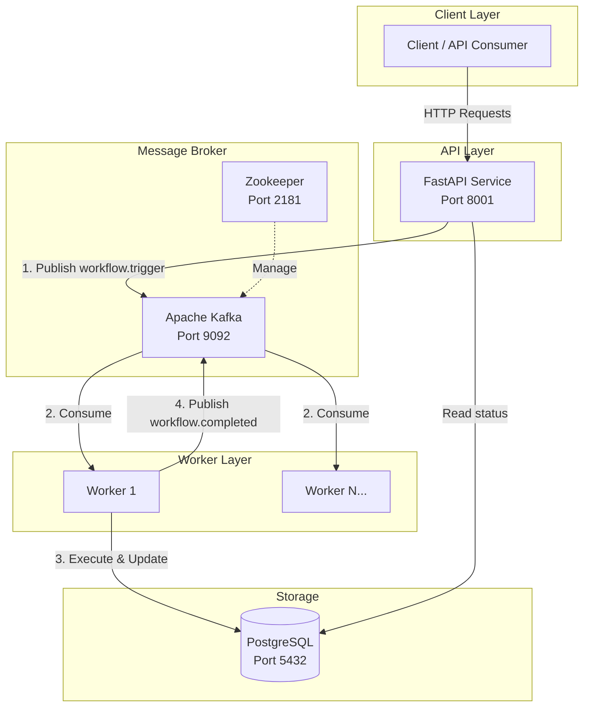
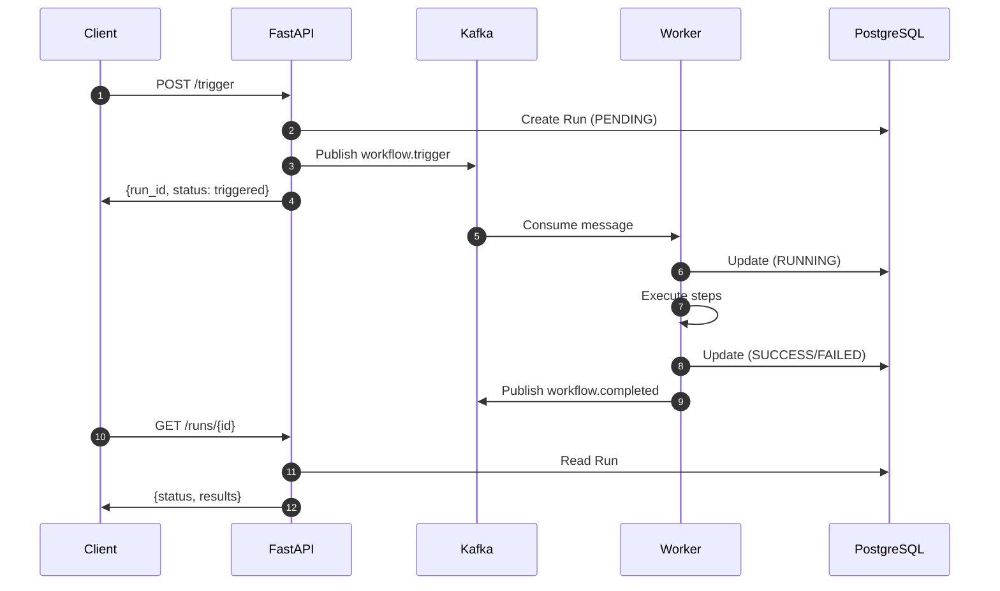

# Workflow Automation Platform

A production-ready workflow automation platform built with FastAPI, PostgreSQL, and Apache Kafka for async execution.

## 🏗️ Architecture



## 📋 Features

- **REST API**: FastAPI-powered endpoints for workflow management
- **Async Execution**: Kafka-based message queue for decoupled processing
- **Multiple Storage Backends**: InMemory, FileSystem, PostgreSQL
- **Horizontal Scaling**: Multiple workers can process workflows
- **Fault Tolerance**: Kafka provides message durability and retries
- **Dockerized**: All services run in containers, no local dependencies

## 🚀 Quick Start

### Prerequisites
- Docker & Docker Compose

### Run the Application

```bash
# Start all services
make up

# View logs
docker-compose logs -f

# Stop services
make down
```

### Access the API

- **Swagger UI**: http://localhost:8001/docs
- **Health Check**: http://localhost:8001/health
- **OpenAPI Spec**: http://localhost:8001/api/v1/openapi.json

## 📚 API Endpoints

### Workflows

| Method | Endpoint | Description |
|--------|----------|-------------|
| POST | `/api/v1/workflows` | Create a workflow |
| GET | `/api/v1/workflows/{id}` | Get a workflow |

### Workflow Runs

| Method | Endpoint | Description |
|--------|----------|-------------|
| POST | `/api/v1/trigger` | Trigger async execution |
| GET | `/api/v1/runs` | List all runs |
| GET | `/api/v1/runs/{id}` | Get run status |

### Example: Create and Trigger a Workflow

```bash
# 1. Create a workflow
curl -X POST http://localhost:8001/api/v1/workflows \
  -H "Content-Type: application/json" \
  -d '{
    "id": "my-workflow",
    "name": "Demo Workflow",
    "description": "A sample workflow",
    "steps": [
      {"name": "delay", "type": "delay", "config": {"duration": 2}},
      {"name": "notify", "type": "webhook", "config": {
        "url": "https://httpbin.org/post",
        "method": "POST",
        "headers": {"Content-Type": "application/json"},
        "body": {"message": "Hello from workflow!"}
      }}
    ]
  }'

# 2. Trigger the workflow
curl -X POST http://localhost:8001/api/v1/trigger \
  -H "Content-Type: application/json" \
  -d '{"workflow_id": "<workflow_uuid>", "payload": {"user": "demo"}}'

# 3. Check run status
curl http://localhost:8001/api/v1/runs/<run_id>
```

## 🧪 Testing

```bash
# Run all tests
make tests

# Run specific test file
docker-compose run --rm workflow poetry run pytest tests/test_messaging.py -v
```

### Test Coverage

| Module | Tests |
|--------|-------|
| Storage (InMemory) | 7 |
| Storage (FileSystem) | 7 |
| Storage (PostgreSQL) | 10 |
| Messaging (Kafka) | 8 |
| Worker | 3 |
| API Integration | 18 |

## 📁 Project Structure

```
workflow-automation/
├── app/
│   ├── api/
│   │   └── v1/
│   │       └── endpoints/      # API routes
│   ├── core/
│   │   └── config.py           # Configuration
│   ├── db/
│   │   ├── models/             # SQLAlchemy models
│   │   └── session.py          # DB session
│   ├── messaging/
│   │   ├── kafka.py            # Kafka producer/consumer
│   │   └── events.py           # Event schemas
│   ├── schemas/                # Pydantic schemas
│   ├── services/               # Business logic
│   ├── storage/                # Storage backends
│   └── worker/
│       └── main.py             # Kafka worker
├── tests/                      # Test files
├── docker-compose.yml
├── Dockerfile
├── Makefile
└── pyproject.toml
```

## ⚙️ Configuration

Environment variables (set in `docker-compose.yml` or `.env`):

| Variable | Default | Description |
|----------|---------|-------------|
| `POSTGRES_HOST` | `workflow_db` | PostgreSQL host |
| `POSTGRES_DB` | `workflow_db` | Database name |
| `POSTGRES_USER` | `postgres` | DB username |
| `POSTGRES_PASSWORD` | `postgres` | DB password |
| `KAFKA_BOOTSTRAP_SERVERS` | `kafka:9092` | Kafka brokers |
| `KAFKA_CONSUMER_GROUP` | `workflow-workers` | Consumer group |

## 🔧 Development

```bash
# Format code
make format

# Install dependencies locally (for IDE support)
poetry install

# Run tests with coverage
docker-compose run --rm workflow poetry run pytest --cov=app --cov-report=html
```

## 🐳 Docker Services

| Service | Image | Port |
|---------|-------|------|
| `workflow` | custom | 8001 |
| `worker` | custom | - |
| `workflow_db` | postgres:16.1 | 5433 |
| `kafka` | confluentinc/cp-kafka:7.5.0 | 9092 |
| `zookeeper` | confluentinc/cp-zookeeper:7.5.0 | 2181 |

## 📊 Event Flow



## 📝 License

MIT License
